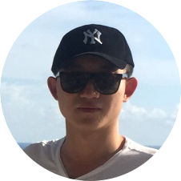

---
#
# Here you can change the text shown in the Home page before the Latest Posts section.
#
# Edit cayman-blog's home layout in _layouts instead if you wanna make some changes
# See: https://jekyllrb.com/docs/themes/#overriding-theme-defaults
#
layout: home
---

 

Hi, I'm Zhengyu Wu 🤓.  

I'm a bachelor in Shanghai Jiao Tong University and I major in software engineering. 

📚  🌍  ♠️  🍔  🏋🏻‍♀️  🎸  🍺  🎲  🖥  🏀

I love reading and travelling, basketball and guitar, eating and fitness, drinking and coding. 

And of course, sleeping 😪. 

